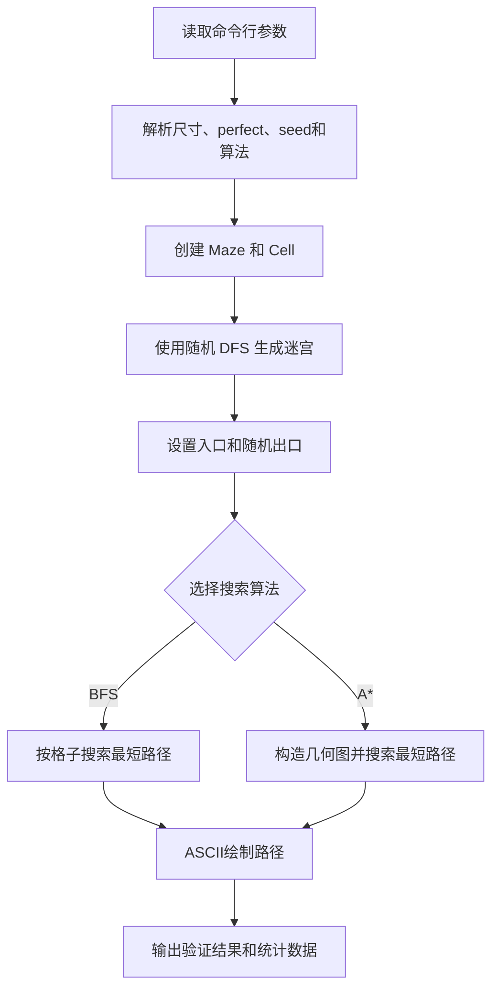

# 迷宫生成与路径搜索系统实验报告

## 1. 题目的要求

### 1.1 实验题目


本实验包含两个任务：

1. **生成迷宫**：结合图形学知识和数据结构的相关算法实现自动随机生成迷宫。迷宫是由水平和垂直墙或障碍组成的网格，开始时所有格子的墙都是完整的。可以模拟一只小老鼠随机放置在某个格子里，小老鼠可以向移动的方向用牙吃掉格子的墙进行移动。
2. **遍历迷宫**：迷宫是一个矩形区域，有一个入口和出口。在迷宫内部不能穿墙或障碍，要求从已知的迷宫中寻找一条从入口到出口的路径。

题目要求采用面向对象分析和设计的方法建模，编程实现：

- 结合算法生成迷宫；
- 结合算法遍历迷宫，找到从入口到出口的路径；
- 对游戏结果进行统计。

### 1.2 本项目完成的内容

本项目实现了一个命令行迷宫系统，主要功能包括：

- 随机生成矩形迷宫；
- 固定入口为左上角，出口随机选择，可以位于内部、边缘或角落；
- 支持完美迷宫和普通连通迷宫两种生成模式；
- 使用 BFS 按格子搜索最短路径；
- 使用几何 A* 搜索考虑斜线移动的最短路径；
- 支持固定 seed，能够重复生成同一个迷宫；
- 将迷宫和算法路径用 ASCII 字符绘制到控制台；
- 统计迷宫尺寸、路径长度、总路程、转弯损耗、预计移动时间和搜索耗时等信息。

### 1.3 项目开发历程

项目采用逐步增加功能的方式完成。最初先实现了一个最小版本：用 `Cell` 和 `Maze` 表示迷宫，用随机 DFS 加回溯拆除墙壁，再用 BFS 从入口搜索到出口，并将结果以 ASCII 字符输出。这个版本先验证了迷宫模型、拆墙逻辑和基本路径搜索是否可行。

在初始版本中，入口和出口分别固定在左上角和右下角。后来将入口保留在 `(0, 0)`，但不再强制出口位于右下角，而是从其他格子中随机选择。这样可以测试出口在边缘、角落以及迷宫内部时的搜索情况。

为了使迷宫生成结果具有更好的参考价值，同时保留不同难度和结构的选择，项目加入了 `-perfect` 参数。使用该参数时生成完美迷宫；不使用时则在保证连通的基础上增加额外通道。之后又加入 `seed-<字符串>` 参数，使同一组参数可以反复生成同一个迷宫，便于调试和比较不同路径算法。

在此基础上，项目进一步讨论了小鼠实际移动方式的问题。若小鼠每到一个格子就直接向左或向右转 90 度，运动轨迹会比较生硬；如果把转弯看作经过墙中点，并允许切过格子的弯角，那么连续转弯时可以用更短的线段连接。为了寻找这种运动模型下的较短路径，项目加入了 A* 算法，并增加 `-bfs` 和 `-astar` 参数来选择搜索方式。

随后又引入了简化的减速机制。小鼠速度大小仍设为 `1 unit/s`，但转弯时根据速度向量的变化量增加额外时间。这样，BFS 得到的格子路径和 A* 得到的几何路径都可以计算转弯时间损耗。A* 在搜索时直接把路程时间和转弯损耗相加作为代价，因此寻找的是预计移动时间较短的路线。在个别迷宫中，A* 可能经过更多格子，但由于转弯更少，损耗时间更少，最终预计移动时间反而更短。这个开发过程也使项目从单纯的网格路径搜索扩展到了带有简单运动约束的几何路径搜索。

## 2. 题目的设计过程

### 2.1 总体设计

系统按照“模型、生成、求解、显示、统计、验证”划分模块。主程序负责读取参数并组织执行顺序，各模块尽量只承担一种职责。

总体流程如下：



程序的基本执行顺序是：

1. 读取行数、列数和可选参数；
2. 将 seed 字符串按 `UTF-8` 编码后计算哈希，取前 8 个字节转换为 `long`，传入 `Random`；
3. 创建所有墙壁完整的迷宫；
4. 使用随机 DFS 拆墙，生成完美迷宫或普通连通迷宫；
5. 设置入口 `(0, 0)`，再随机设置一个不与入口重合的出口；
6. 根据 `-bfs` 或 `-astar` 选择路径搜索算法；
7. 计算总路程、转弯时间损耗和预计移动时间；
8. 绘制迷宫、标记路径并输出统计信息。

### 2.2 详细设计

#### 2.2.1 迷宫模型

迷宫由 `Maze`、`Cell` 和 `Direction` 三个类组成。

- `Cell` 保存行列坐标、访问状态和上下左右四面墙；
- `Direction` 定义四个移动方向及其坐标变化量；
- `Maze` 管理二维格子，提供坐标检查、获取邻居、设置入口和出口、拆墙等操作。

迷宫初始化时，每个格子的四面墙都存在。两个相邻格子之间的墙必须同步修改，因此拆墙统一通过 `Maze.removeWall` 完成。例如，移除左格子的右墙时，同时移除右格子的左墙，这样可以避免墙状态不一致。

#### 2.2.2 迷宫生成算法：随机 DFS 与回溯

迷宫生成使用随机深度优先搜索和回溯。算法开始时随机选择一个格子作为起点，然后不断向未访问邻居移动。

基本步骤如下：

1. 随机选择一个起始格子并标记为已访问；
2. 查询当前格子的未访问邻居；
3. 如果存在未访问邻居，随机选择其中一个；
4. 移除当前格子和新格子之间的墙，将当前格子压入栈；
5. 移动到新格子并标记为已访问；
6. 如果当前格子没有未访问邻居，则从栈中弹出上一个格子进行回溯；
7. 当访问数量达到总格子数时结束。

实现中使用 `Deque<Cell>` 模拟栈，并使用 `visitedCount` 判断生成是否完成。每次只保留一次随机选择，不再先打乱邻居列表再随机取下标。

设格子数量为 `V = rows * cols`，标准 DFS 回溯生成过程会访问每个格子，并检查有限个方向，因此时间复杂度为 `O(V)`，栈和访问标记的空间复杂度为 `O(V)`。

选择该算法的原因是：它与课程中的栈、递归、回溯和图遍历知识联系紧密，代码结构清楚，能够自然生成连通迷宫，并且随机选择邻居后每次运行都可能得到不同布局。

#### 2.2.3 完美迷宫与普通连通迷宫

把每个格子看成一个节点，把两个格子之间的无墙连接看成一条边，可以将迷宫转化为图。

**完美迷宫**需要满足：

1. 所有格子都连通；
2. 任意两个格子之间只有一条路径；
3. 图中不存在环。

因此，完美迷宫对应一棵树。对于 `V` 个格子，内部通道数应为 `V - 1`。

本项目的 `-perfect` 参数只运行随机 DFS 拆墙，不额外拆墙，所以生成结果是一棵连通树。未使用 `-perfect` 时，程序先生成一个完美迷宫，再随机拆除部分仍存在的内部墙，形成额外通道。此时迷宫仍然连通，但可能出现环和多条可行路径，因此验证结果通常不是完美迷宫。

`MazeValidator` 通过两项检查验证完美迷宫：

- 从 `(0, 0)` 使用 BFS 检查是否能访问全部格子；
- 只统计每个格子的右墙和下墙，计算不重复的开放连接数，并判断是否等于 `V - 1`。

#### 2.2.4 BFS 路径搜索

BFS 将每个格子作为图节点，将没有墙阻挡的相邻格子作为边。它使用队列从入口开始逐层搜索，并用 `parent` 记录每个格子是从哪个格子到达的。

当每次移动一个格子的代价都相同时，BFS 先访问到的路径一定具有最少的格子数。因此，BFS 适合回答“按格子移动时哪条路径最短”。搜索结束后，程序再对这条路径计算总路程和转弯损耗。

其主要步骤是：

1. 将入口放入队列并标记访问；
2. 取出队首格子，检查上下左右四个方向；
3. 只将合法、无墙且未访问的邻居加入队列；
4. 记录邻居的前驱节点；
5. 搜索到出口后，从出口沿前驱节点回溯到入口。

BFS 的时间复杂度为 `O(V)`，空间复杂度为 `O(V)`。输出中的“路径长度”表示路径列表中的格子数量，“总路程”按相邻格子中心之间的距离计算；在当前单位下，每移动一个格子为 `1 unit`。“访问状态数”表示实际从队列取出并处理的格子数量。

#### 2.2.5 几何 A* 路径搜索

为了模拟小鼠以 `1 unit/s` 的速度沿几何路径移动，A* 不只把格子当成节点，而是构造了一个几何图：

- 每个格子的中心是一个几何节点；
- 每个可通行墙的中点也是一个几何节点；
- 节点之间的边权是欧氏距离；
- 搜索状态还包含当前运动方向。

A* 使用以下评价函数：

```text
f(n) = g(n) + h(n)
```

其中，`g(n)` 是起点到当前状态的预计时间代价，`h(n)` 是当前节点到终点的欧氏距离除以速度得到的时间下界。由于速度设为 `1 unit/s`，路程部分的时间数值等于路程，但最终预计移动时间还要加上转弯损耗。

状态中加入运动方向，是为了表达小鼠不直接进行生硬的 90 度转弯这一设定。路径图允许小鼠从格子中心走到墙中点，再在格子内部连接不同墙中点，从而用两段 45 度方向的线段近似完成转弯。连续方向相同的部分则可以保持直线运动。

当前实现将相邻运动方向的变化限制为不超过 90 度，以避免某些迷宫在严格限制下没有可行路径。这是一个工程上的折中：A* 以预计移动时间为主要优化目标，同时保留方向状态和斜向转弯模型；如果要建立更严格的物理运动模型，还可以进一步细化边和转弯约束。

A* 的理论搜索复杂度取决于几何图节点和边的数量。对于本项目的网格规模，图的规模仍与迷宫格子数成线性关系，但由于一个格子可能连接多个墙中点，实际常数开销高于 BFS。

#### 2.2.6 转弯时间损耗模型

为了不引入复杂的摩擦力、加速度和转弯半径计算，程序只根据转弯前后的速度向量夹角估计损耗时间。设小鼠速率为 `v`，转弯角为 `θ`，则速度向量的变化量为：

```text
|Δv| = 2v sin(θ / 2)
```

将其除以速度大小后得到速度变化比例，再乘以经验系数 `k`，得到转弯时间损耗：

```text
Δt = k × 2 sin(θ / 2)
```

当前程序取：

```text
v = 1 unit/s
k = 0.25 s
```

因此，直行时 `θ = 0`，损耗为 `0`；转弯角越大，损耗越大。BFS 搜索完成后，对格子路径的每个方向变化计算一次损耗。A* 则在扩展搜索状态时直接将路程时间和本次转弯损耗加入累计代价。

预计移动时间为：

```text
预计移动时间 = 总路程 / v + 所有转弯损耗
```

该模型是对真实运动过程的简化，适合用于比较不同路线的相对优劣，不表示精确的物理仿真结果。

#### 2.2.7 BFS 与 A* 的路径差异

两种算法解决的“最短”不是完全相同的概念：

| 比较项目 | BFS | A* |
|---|---|---|
| 搜索对象 | 迷宫格子 | 格子中心、通道中点和方向状态 |
| 优化目标 | 经过格子数最少，之后计算时间 | 预计移动时间最短 |
| 移动模型 | 上下左右按格子移动 | 允许在格子内部按几何线段移动 |
| 结果指标 | 路径格子数、总路程和预计时间 | 总路程、转弯损耗和预计时间 |
| 适用场景 | 传统网格最短路 | 模拟具有速度和转向约束的移动 |

因此，同一个普通连通迷宫中，BFS 和 A* 可能经过不同的格子。BFS 的路径保证格子数量最少，但可能拐弯较多；A* 允许切过弯角，并把转弯损耗纳入代价，可能选择经过更多格子的路线，但总路程和转弯损耗的组合更有利，最终预计时间更短。A* 的访问状态数也不能直接和 BFS 的访问格子数等价比较，因为 A* 的一个位置可能对应多个不同方向状态。

ASCII 字符中没有适合表示 45 度线段的统一字符，所以当前地图只用 `*` 标记 A* 路径经过的格子，不绘制实际斜线。总路程、转弯损耗和预计移动时间仍单独在统计中输出。

#### 2.2.8 seed 与结果复现

程序支持 `seed-<字符串>` 参数。seed 后面的内容先按 UTF-8 编码，再通过 SHA-256 计算摘要，取摘要前 8 个字节转换为 Java `long`，最后传给 `Random`。

同一个字符串经过同一个确定性的 SHA-256 算法后会得到相同的 `long`。在行数、列数、生成模式和参数顺序相同的情况下，随机数调用顺序也相同，因此迷宫墙壁、出口位置和搜索结果可以复现。

如果不传入 seed，程序会自动生成一个 UUID 作为本次随机种子，并打印为 `seed-...` 形式。复制这段 seed 后再次运行，可以重现本次迷宫。

## 3. 编程语言的选择

本项目选择 Java，主要原因如下：

1. Java 适合实现面向对象模型，可以用类清楚地表示迷宫、格子、方向、生成器和求解器；
2. Java 标准库提供 `Deque`、`Queue`、`PriorityQueue`、`HashMap` 和 `HashSet`，能够直接支持 DFS、BFS 和 A*；
3. Java 的枚举适合表示四个固定移动方向；
4. Java 的类型检查有助于减少坐标、节点和路径对象混用造成的错误；
5. Gradle 和 JUnit 可以方便地运行自动化测试；
6. SHA-256、UUID 和随机数等功能都可以使用标准库完成，不需要额外依赖。

项目使用 Java 标准库和 JUnit 5，构建工具为 Gradle。

## 4. 代码规范的说明

项目采用以下代码规范：

- 使用有意义的英文类名、方法名和变量名，类名采用 PascalCase，方法和变量采用 camelCase；
- 一个类主要负责一个方面，例如 `MazeGenerator` 负责生成，`MazeSolver` 负责 BFS/DFS，`AStarMazeSolver` 负责几何 A*；
- 将墙壁同步、坐标合法性等公共操作封装在 `Maze` 中，避免多个模块重复实现；
- 使用枚举 `Direction` 表示方向，避免在代码中散落数字坐标偏移量；
- 使用 record 保存简单的数据结构，如 `GeometryNode`、`GeometryEdge` 和 `GeometricPathResult`；
- 对非法尺寸、非法参数和不相邻拆墙操作抛出明确的异常；
- 通过 `MazeTest` 对连通性、路径合法性、seed 复现、完美迷宫和 A* 基本行为进行测试；
- 保持渲染、算法和统计相互独立，便于后续替换输出方式或增加新的求解器。

## 5. 核心代码的实现

### 5.1 随机 DFS 生成核心逻辑

```java
int totalCells = maze.getRows() * maze.getCols();
int visitedCount = 1;
Cell current = maze.getCell(
        random.nextInt(maze.getRows()),
        random.nextInt(maze.getCols())
);
current.setVisited(true);

while (visitedCount < totalCells) {
    List<Cell> neighbors = getUnvisitedNeighbors(maze, current);
    if (!neighbors.isEmpty()) {
        Cell next = neighbors.get(random.nextInt(neighbors.size()));
        stack.push(current);
        maze.removeWall(current, next);
        current = next;
        current.setVisited(true);
        visitedCount++;
    } else {
        current = stack.pop();
    }
}
```

这里的 `visitedCount` 使生成过程不需要反复扫描整个迷宫判断是否完成。

### 5.2 BFS 核心逻辑

```java
queue.offer(entrance);
visited.add(entrance);

while (!queue.isEmpty()) {
    Cell current = queue.poll();
    visitedCount++;
    if (current.equals(exit)) {
        return buildPath(parent, entrance, exit);
    }

    for (Direction direction : Direction.values()) {
        Cell neighbor = maze.getNeighbor(current, direction);
        if (neighbor != null
                && !current.hasWall(direction)
                && visited.add(neighbor)) {
            parent.put(neighbor, current);
            queue.offer(neighbor);
        }
    }
}
```

`parent` 映射负责保存路径前驱，搜索结束后从出口反向回溯即可得到完整路径。

### 5.3 A* 核心逻辑

```java
int turnSteps = current.heading() == NO_HEADING
        ? 0
        : TurnPenaltyModel.turnDistance(
                current.heading(), edge.heading());
double turnPenalty = TurnPenaltyModel.calculateTurnPenalty(turnSteps);
double nextTime = currentDistance
        + edge.distance() / TurnPenaltyModel.SPEED_UNITS_PER_SECOND
        + turnPenalty;
if (nextTime < distances.getOrDefault(next,
        Double.POSITIVE_INFINITY)) {
    distances.put(next, nextTime);
    parents.put(next, current);
    queue.offer(new QueueEntry(
            next,
            nextTime + heuristic(edge.target(), goal)
                    / TurnPenaltyModel.SPEED_UNITS_PER_SECOND,
            nextTime
    ));
}
```

A* 的优先队列按照 `g(n) + h(n)` 排序。`distances` 保存到达某个“节点 + 方向”状态的最短预计时间，`parents` 用于还原几何路径。路径还原后，程序分别统计总路程、转弯损耗和预计移动时间。

### 5.4 参数解析和运行命令

程序基本格式为：

```bash
./gradlew run --args='m n [选项]'
```

支持的参数如下：

| 参数 | 说明 |
|---|---|
| `m n` | 迷宫行数和列数，必须是正整数 |
| `-perfect` | 生成完美迷宫；不写则生成普通连通迷宫 |
| `seed-<字符串>` | 使用固定字符串种子；相同 seed 可复现结果 |
| `-bfs` | 使用按格子的 BFS，并计算该路径的时间损耗；不写算法参数时默认使用 BFS |
| `-astar` | 使用加入转弯损耗的几何 A* |

`-bfs` 和 `-astar` 不能同时使用。参数可以按照约定组合使用，例如：

```bash
./gradlew run --args='7 9 -perfect seed-9bdb6856-7ad9-4434-9eb4-351bde635fbd -astar'
```

使用 BFS 测试同一个迷宫：

```bash
./gradlew run --args='7 9 -perfect seed-9bdb6856-7ad9-4434-9eb4-351bde635fbd -bfs'
```

不指定 seed：

```bash
./gradlew run --args='7 9 -astar'
```

程序会打印自动生成的 `seed-...`，下次可以把它复制到命令中复现本次结果。

两种算法都会输出以下时间相关指标：

```text
总路程: ... units
转弯时间损耗: ... s
预计移动时间: ... s
```

其中，BFS 的总路程按格子中心之间的距离计算；A* 的总路程按几何图中的线段距离计算。

## 6. 问题和讨论

### 6.1 BFS 与 A* 的“最短”含义不同

BFS 保证的是格子数量最少，A* 优化的是加入转弯损耗后的预计移动时间。两者的路径长度不能直接用同一个指标判断优劣。实验时应固定迷宫 seed，分别运行 `-bfs` 和 `-astar`，再比较总路程、转弯损耗和预计时间。

### 6.2 A* 的几何模型仍有简化

当前 A* 用格子中心和通道中点近似小鼠运动轨迹，并用方向状态限制转弯。真实运动还可以考虑小鼠的尺寸、转弯半径、墙壁宽度和连续曲线，这些内容超出了当前课程实验的基本范围。

另外，当前转向限制允许不超过 90 度的方向变化，严格的 45 度运动约束还可以继续建模。转弯损耗公式中的系数 `k = 0.25 s` 是简化模型中的经验参数，不代表真实小鼠的实验测量值。若将限制收紧，必须同时保证几何图中存在足够的可行转向边，否则部分迷宫可能找不到路径。

### 6.3 访问数量不能直接横向比较

BFS 的搜索状态基本对应一个格子，A* 的搜索状态是“几何节点 + 方向”。因此 A* 输出的访问状态数与 BFS 输出的访问格子数定义不同。后续如果要做严格性能对比，可以分别统计扩展的格子数、几何节点数和方向状态数。

### 6.4 生成算法还有优化空间

当前普通迷宫模式会先收集所有候选墙，再随机拆除其中一部分。对于特别大的迷宫，可以改为边遍历边采样，减少候选列表占用的内存；也可以使用并查集、随机 Kruskal 或随机 Prim 生成其他风格的迷宫。

### 6.5 统计结果受运行环境影响

迷宫生成和搜索耗时使用 `System.nanoTime()` 测量，适合观察相对差异，但单次运行会受到 JVM 启动、JIT 编译和操作系统调度影响。若要得出更稳定的结论，可以固定 seed，预热程序后重复运行多次并取平均值。

### 6.6 测试覆盖范围

当前测试已经覆盖完美迷宫、普通迷宫连通性、BFS/DFS 路径、BFS 路径指标、A* 相邻格子和 L 形路径、随机出口、seed 复现以及拆墙同步。还可以补充：

- 多组固定 seed 下的 BFS/A* 结果一致性测试；
- `1 x n`、`n x 1` 和 `1 x 1` 迷宫的 A* 测试；
- 非法参数和重复算法参数的命令行测试；
- A* 找不到路径时的输出测试；
- 大尺寸迷宫的性能测试。

## 7. 总结体会

本实验将图遍历、栈和队列、随机数、面向对象设计以及简单的几何建模结合到了一起。迷宫生成部分通过随机 DFS 和回溯体现了栈结构的使用，BFS 体现了队列逐层搜索的特点，A* 则进一步把路径代价从“经过多少格子”扩展到了“实际走了多长距离以及转弯需要付出的时间”。

在实现过程中，seed 复现和 ASCII 可视化对调试很有帮助。固定同一个 seed 后，可以只更换搜索算法而保持迷宫完全一致，这使 BFS 和 A* 的比较更加可靠。加入转弯损耗后，BFS 和 A* 都能输出总路程、损耗时间和预计移动时间，从而可以观察“路线更长但转弯更少”的情况。完美迷宫验证也让生成结果不只是“看起来像迷宫”，而是可以通过连通性和通道数量进行程序化判断。

目前系统已经完成题目要求的迷宫生成、路径搜索和结果统计，并保留了继续扩展的空间。后续可以围绕更精确的运动学模型、更丰富的生成算法、图形界面和批量性能测试继续完善。
